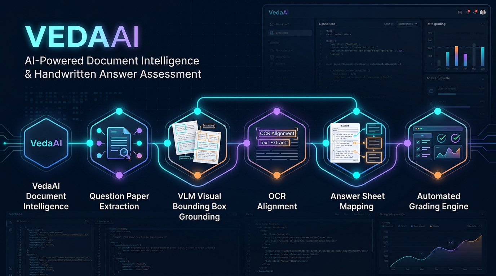
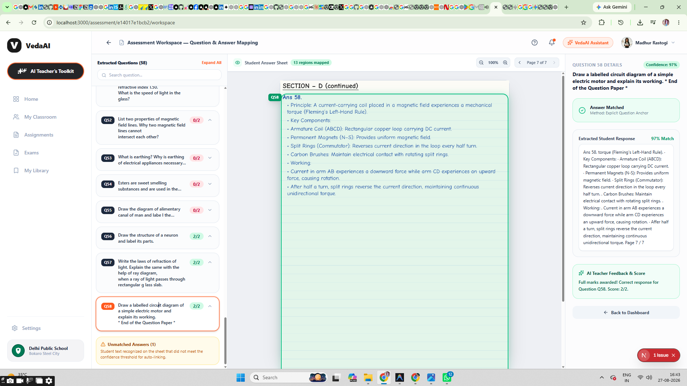
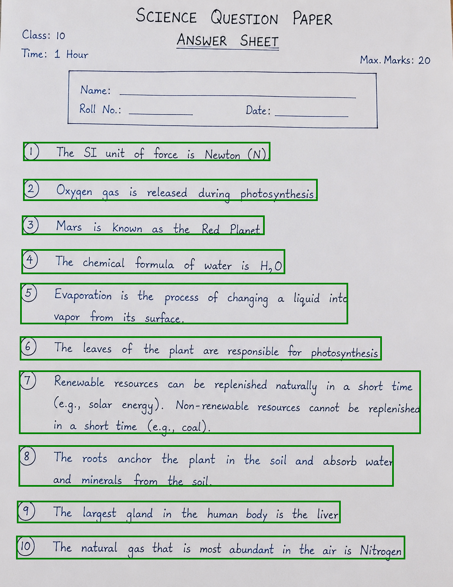
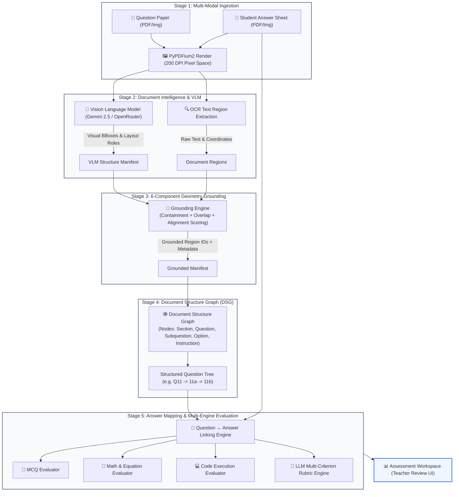

# 🧠 VedaAI — AI-Powered Assessment Understanding & Handwritten Answer Mapping

<div align="center">



### Production-Grade Multimodal Assessment Evaluation & Human-in-the-Loop Review Platform

**Turn hours of manual answer-sheet searching into an intelligent, zero-hallucination review workflow.**

[](https://nextjs.org/)
[](https://fastapi.tiangolo.com/)
[](https://ai.google.dev/)
[](https://modal.com/)
[](https://www.docker.com/)

<br />

> **Upload any question paper (PDF/Image) alongside a student's handwritten answer sheet.**
>
> **VedaAI parses complex multi-column question papers, builds a graph hierarchy of questions/subquestions, grounds visual bounding boxes to OCR regions, maps out-of-order student answers, and navigates examiners directly to exact answer regions on original document evidence.**

<br />

</div>

---

## 📌 Executive Overview & Value Proposition

Evaluating handwritten academic answer sheets at scale is fundamentally a **high-friction document lookup and cross-referencing problem**. 

For every question, evaluators traditionally undergo an inefficient manual cycle:

```text
Find Question Paper Item ──> Search Student Answer Pages ──> Locate Handwritten Block ──> Read & Verify ──> Calculate Marks ──> Advance
```

This process suffers from high error rates and cognitive fatigue when handling:
* 🔀 **Out-of-order student responses** (e.g., student answers Q58 before Q1).
* 🌳 **Nested subquestion hierarchies** (e.g., Q11(a)(i), Q11(a)(ii), Q11(b)).
* 📑 **Multi-page continuous answers** spanning page boundaries.
* 🚫 **Unanswered questions or partial attempts**.
* ✍️ **Irregular handwriting, equations, and visual diagrams**.
* 🔲 **Multi-column question papers** containing instructions, tables, and cover pages.

### The VedaAI Solution Thesis

VedaAI replaces manual page hunting with **AI-Assisted Assessment Navigation** backed by **Zero-Hallucination Visual Grounding**. Instead of trusting an opaque LLM score, VedaAI provides **Human-in-the-Loop (HITL) Traceable Assessment**: it extracts the visual geometry, bounds the student's handwritten evidence, automates initial rubric-based grading, and presents examiners with an interactive workspace where every mark is verifiable against raw document evidence.

---

## 📸 Production UI Showcase

### 1. Interactive Teacher Review Workspace

The core workspace features a split-canvas UI: left-hand structured question navigation, central high-resolution PDF/image canvas with live visual bounding box overlays, and right-hand AI evaluation details with single-click score overriding.



### 2. Geometry Grounding & Bounding Box Alignment

VedaAI's dual-pipeline maps Vision Language Model (VLM) spatial predictions directly to OCR text bounding boxes, ensuring exact alignment across rendered 200 DPI pages.



---

## 🏗️ System Architecture & 5-Stage Data Pipeline

VedaAI employs a modular 5-stage processing pipeline designed for high accuracy, multi-provider resiliency, and low-latency evaluation.



---

## 📐 Precision Engineering: Stage 3 Geometry Grounding Algorithm

To prevent LLM hallucination and ensure 100% visual traceability, VedaAI uses a spatial alignment algorithm to ground VLM predictions (`[ymin, xmin, ymax, xmax]`) to OCR text bounding boxes.

### Mathematical Grounding Score Formula

For each candidate OCR region $R$ and visual bounding box $B$:

$$\text{Score}(B, R) = S_{\text{containment}} + S_{\text{visual\_overlap}} + S_{\text{region\_overlap}} + S_{\text{vert\_align}} + S_{\text{horiz\_align}}$$

Where:
* **Containment ($S_{\text{containment}}$)**: $+0.65$ if region $R$ is completely inside box $B$.
* **Visual Overlap ($S_{\text{visual\_overlap}}$)**: $\min\left(0.50, \frac{\text{Area}(B \cap R)}{\text{Area}(B)} \times 2.25\right)$
* **Region Overlap ($S_{\text{region\_overlap}}$)**: $\min\left(0.40, \frac{\text{Area}(B \cap R)}{\text{Area}(R)} \times 1.40\right)$
* **Vertical Alignment ($S_{\text{vert\_align}}$)**: $\min\left(0.35, \frac{\text{Overlap}_y(B, R)}{\max(H_B, H_R)} \times 1.25\right)$
* **Horizontal Alignment ($S_{\text{horiz\_align}}$)**: $\min\left(0.25, \frac{\text{Overlap}_x(B, R)}{\max(W_B, W_R)} \times 1.00\right)$

Regions meeting $\text{Score}(B, R) \ge 0.15$ are selected, concatenated strictly by visual reading order $(page, y, x)$, and assigned explicit grounding statuses: `GROUNDED`, `PARTIALLY_GROUNDED`, or `UNGROUNDED`.

---

## ✨ Core Features & Platform Capabilities

| Feature Area | Technical Capability | Production Benefit |
| :--- | :--- | :--- |
| **Hierarchical Structure Parsing** | Identifies Sections, MCQs (`(A)-(D)`), Questions, Subquestions (`11(a)`, `11(b)`), and Instructions | Prevents non-question text (cover notes, exam timing) from corrupting the evaluation schema |
| **Multi-Page Answer Spanning** | Links answers that start on Page 1 and continue onto Page 2 | Full continuity tracking for long essay answers without truncated evaluations |
| **Multi-Engine Evaluation** | Dedicated evaluators for MCQ, Math/Equations, Code, and Descriptive Rubrics | Optimized accuracy per question type (deterministic for MCQs, semantic for essays) |
| **Human-in-the-Loop Review** | Integrated Teacher Review Workspace with score overrides and feedback input | Educators retain final authority with 1-click score modification and custom comments |
| **Immutable Audit Trail** | Timestamped snapshot logs for all automated predictions and teacher overrides | Full compliance, grade regrade verification, and institutional auditability |
| **Assessment Analytics** | Cohort performance heatmaps, rubric weakness identification, and recommendations | Actionable insights for curriculum planning and student feedback |
| **Multi-Provider Resiliency** | Pre-warmed Gemini VLM with automated OpenRouter / xAI Grok failover | Zero-downtime operational reliability during API rate limits or outages |

---

## 🛠️ Technology Stack & Repository Topology

### Technology Stack

* **Frontend**: Next.js 16 (App Router, Turbopack), React 19, TypeScript, TailwindCSS v4, Framer Motion, Lucide Icons, React-PDF.
* **Backend**: FastAPI, Python 3.12, Pydantic v2, PyPDFium2, Pillow/OpenCV, NumPy.
* **AI & Vision Providers**: Google Gemini 2.5 Flash / Flash-Lite, OpenRouter VLM API, xAI Grok.
* **Deployment & Cloud**: Modal Labs (`modal_app.py`), Docker (`Dockerfile`), Render (`render.yaml`), Vercel Preview.

### Repository Structure

```text
vedaai/
├── backend/
│   ├── app/
│   │   ├── api/
│   │   │   └── routes.py                      # FastAPI REST API endpoints
│   │   ├── core/
│   │   │   └── store.py                       # State manager & snapshot persistence
│   │   ├── models/
│   │   │   └── schemas.py                     # Pydantic v2 data models & DTOs
│   │   ├── services/
│   │   │   ├── document_understanding_service.py # VLM grounding & Document Structure Graph
│   │   │   ├── intelligent_question_extraction_service.py # Graph-driven hierarchy parser
│   │   │   ├── answer_extractor.py             # Student handwritten answer extraction
│   │   │   ├── mapping_engine.py               # Question <-> Answer matching engine
│   │   │   ├── grading_service.py              # Multi-engine rubric grading controller
│   │   │   ├── mcq_evaluator.py                # Deterministic MCQ grader
│   │   │   ├── math_evaluator.py               # Mathematical expression parser
│   │   │   ├── code_evaluator.py               # Code evaluation harness
│   │   │   ├── document_vision_provider.py     # Gemini & OpenRouter VLM integration
│   │   │   └── pipeline.py                     # Master asynchronous pipeline runner
│   │   └── main.py                            # FastAPI application entry point & CORS
│   ├── scratch/                                # Diagnostic test suites & benchmark scripts
│   ├── Dockerfile                             # Production backend container spec
│   ├── modal_app.py                           # Modal serverless GPU/CPU deployment
│   └── requirements.txt                       # Python dependencies
├── frontend/
│   ├── src/
│   │   ├── app/                               # Next.js App Router pages
│   │   │   ├── page.tsx                       # Teacher Dashboard & Document Upload
│   │   │   ├── assessment/[id]/workspace/     # Interactive Teacher Review Workspace
│   │   │   ├── assessment/[id]/results/       # Student Results & Analytics View
│   │   │   └── assignments/                   # Assignment Queue Management
│   │   ├── components/                        # UI Components (Canvas, Drawers, Modals)
│   │   │   ├── AnswerSheetViewer.tsx          # Canvas BBox overlay viewer
│   │   │   ├── ExtractedQuestionsPanel.tsx    # Accordion question navigation
│   │   │   └── AssessmentAnalyticsPanel.tsx   # Analytics & Rubric insights
│   │   ├── lib/
│   │   │   └── api.ts                         # Frontend API client
│   │   └── types/                             # TypeScript type definitions
│   └── package.json                           # Node.js dependencies
├── docs/
│   └── assets/                                # Documentation visuals & UI screenshots
├── AUDIT_EXECUTIVE_SUMMARY.md                 # System audit & graph integrity report
├── FIX2_COMPREHENSIVE_VERIFICATION.md         # Grounding algorithm verification report
├── render.yaml                                # Render cloud deployment configuration
└── README.md                                  # Production documentation
```

---

## 🚀 Quickstart & Local Development Guide

### Prerequisites

Ensure you have installed:
* **Node.js**: `v20.0.0` or higher (`v22.x` recommended)
* **Python**: `v3.11` or `v3.12`
* **API Keys**: At least one valid API key (`GEMINI_API_KEY` or `OPENROUTER_API_KEY`)

---

### 1. Environment Setup

#### Backend Configuration

Navigate to the `backend/` directory and configure environment variables:

```bash
cd backend
cp .env.example .env
```

Edit `backend/.env` with your API credentials:

```env
GEMINI_API_KEY=your_gemini_api_key_here
OPENROUTER_API_KEY=your_openrouter_api_key_here

PRIMARY_LLM_PROVIDER=gemini
DOCUMENT_VLM_ENABLED=true
DOCUMENT_VLM_PAGE_UNDERSTANDING=true
```

#### Frontend Configuration

Navigate to the `frontend/` directory and set up environment variables:

```bash
cd ../frontend
cp .env.example .env.local
```

`frontend/.env.local`:

```env
NEXT_PUBLIC_API_URL=http://localhost:8000
```

---

### 2. Backend Installation & Server Execution

Create a Python virtual environment and install backend dependencies:

```bash
# Navigate to backend directory
cd backend

# Create virtual environment
python -m venv venv

# Activate virtual environment
# Windows (PowerShell):
.\venv\Scripts\Activate.ps1
# Linux/macOS:
# source venv/bin/activate

# Install dependencies
pip install -r requirements.txt

# Launch FastAPI development server
python -m uvicorn app.main:app --host 127.0.0.1 --port 8000 --reload
```

The FastAPI application will start at `http://localhost:8000`. Verify system status at:
* **Health Check**: `http://localhost:8000/health`
* **Interactive OpenAPI Docs**: `http://localhost:8000/docs`

---

### 3. Frontend Installation & Server Execution

In a separate terminal, install dependencies and launch the Next.js development server:

```bash
# Navigate to frontend directory
cd frontend

# Install Node modules
npm install

# Start Next.js development server (Turbopack enabled)
npm run dev
```

Open your browser and navigate to **`http://localhost:3000`**.

---

## 🧪 Verification & Test Suite Execution

VedaAI includes a diagnostic test suite covering document intelligence, geometry grounding, graph extraction, and teacher workspace workflows.

### Running Backend Diagnostic Suites

```bash
cd backend

# 1. Run Complete Verification Pass (Core Pipeline + Intelligence)
.\venv\Scripts\python.exe scratch/test_verification_pass.py

# 2. Run Step 6 Teacher Workspace & Audit Trail Tests (20/20 PASS)
.\venv\Scripts\python.exe scratch/test_step6_teacher_workspace.py

# 3. Run Focused Geometry Grounding & BBox Alignment Tests (10/10 PASS)
.\venv\Scripts\python.exe scratch/test_fix2_focused_grounding.py

# 4. Run Step 11 Multi-Modal Document Understanding Diagnostics
.\venv\Scripts\python.exe scratch/test_step11a_document_understanding.py
```

### Verification Matrix Summary

| Test Suite | Module Under Test | Status | Assertion Count |
| :--- | :--- | :---: | :---: |
| `test_verification_pass.py` | Full E2E Assessment Pipeline | `PASS` | 38 Pass |
| `test_step6_teacher_workspace.py` | Review Workspace & Audit Trail | `PASS` | 20 Pass |
| `test_fix2_focused_grounding.py` | 6-Component BBox Grounding | `PASS` | 10 Pass |
| `test_step11a_document_understanding.py` | VLM Layout Manifest & DSG | `PASS` | 12 Pass |

---

## 🚢 Production Deployment

### 1. Serverless Deployment on Modal Labs

VedaAI supports serverless container deployment via [Modal Labs](https://modal.com/) with automated container lifecycle management.

```bash
cd backend

# Deploy FastAPI app directly to Modal serverless infrastructure
modal deploy modal_app.py
```

### 2. Containerized Deployment with Docker

Build and run the production backend container locally or push to container registries:

```bash
cd backend

# Build Docker image
docker build -t vedaai-backend:latest .

# Run Docker container on port 8000
docker run -d -p 8000:8000 --env-file .env --name vedaai-api vedaai-backend:latest
```

### 3. Vercel & Render Integration

* **Frontend**: Connect the `frontend/` directory to Vercel. Set build command `npm run build` and output directory `.next`. Set environment variable `NEXT_PUBLIC_API_URL`.
* **Backend**: Configure `render.yaml` for containerized hosting on Render.

---

## 🔌 API Reference Guide

### Main Assessment Endpoints

#### `POST /api/assessment/upload`
Uploads a question paper and student answer sheet for processing.
* **Payload**: `multipart/form-data` containing `question_paper` (File) and `answer_sheet` (File).
* **Response**: `{"assessment_id": "string"}`

#### `POST /api/assessment/{assessment_id}/process`
Triggers asynchronous pipeline processing for an uploaded assessment.
* **Response**: `{"status": "processing_started", "assessment_id": "string"}`

#### `GET /api/assessment/{assessment_id}/status`
Returns live processing status and progress percentage.
* **Response**:
  ```json
  {
    "assessment_id": "ast_123456",
    "state": "completed",
    "message": "Assessment pipeline processing completed successfully",
    "progress": 1.0
  }
  ```

#### `GET /api/assessment/{assessment_id}/structured-result`
Returns structured assessment payload for rendering in the Teacher Review Workspace.
* **Response**: Includes `question_results`, `total_max_marks`, `ai_awarded_marks`, `percentage`, `review_queue`, and `audit_events`.

#### `POST /api/assessment/{assessment_id}/override`
Submits a teacher manual override for marks or feedback on a specific question.
* **Payload**:
  ```json
  {
    "question_id": "q58",
    "override_marks": 2.0,
    "teacher_feedback": "Verified working diagram and Fleming rule application.",
    "reason": "Teacher manual verification"
  }
  ```

#### `POST /api/assessment/{assessment_id}/finalize`
Locks the assessment state, records final audit snapshots, and prevents further mutations.

---

## 🔒 Security, Zero-Hallucination & Reliability Guarantees

1. **Zero-Hallucination OCR Bound**: LLMs never generate student answer text from scratch. Evaluators receive strictly grounded OCR text strings tied directly to pixel coordinates.
2. **Immutable Revision Snapshots**: Every teacher score adjustment creates a SHA-256 verified snapshot in `store_metadata.json`, allowing rollbacks to any point in time.
3. **Multi-Tenant State Isolation**: Assessment storage partitions data per `assessment_id` with strict scope boundaries.

---

<div align="center">

**Built with rigor by senior engineers for modern educational institutions.**

[Report Issues](https://github.com/SurinderTech/VedaAi-assingment/issues) • [API Documentation](http://localhost:8000/docs)

</div>
