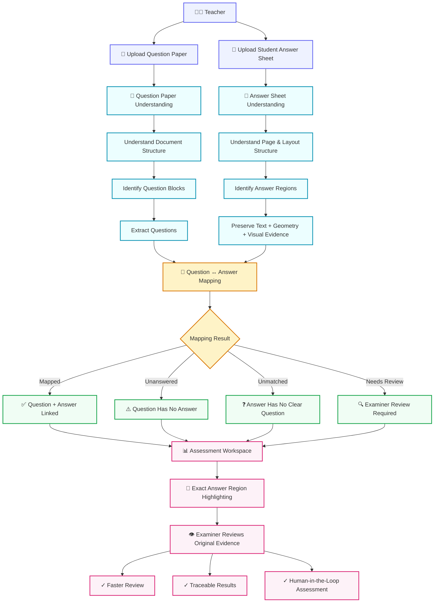

# VedaAI

<div align="center">

# 🧠 VedaAI

### AI-Powered Assessment Understanding & Answer Mapping

**Turn hours of manual answer-sheet searching into an intelligent review workflow.**

[](YOUR_DEMO_URL)
[](YOUR_GITHUB_URL)
[]()
[]()
[]()

<br />

> **Upload a question paper + a student's handwritten answer sheet.**
>
> **VedaAI extracts the assessment structure, identifies answers, maps them to questions, and visually takes the examiner to the exact answer region.**

<br />

</div>

---
# What is VedaAI 
VedaAI is an AI-powered assessment assistant that understands question papers and handwritten answer sheets, maps each answer to the correct question, and highlights the exact answer region—helping teachers review assessments faster and more efficiently.


# 🎯 Why VedaAI?

Evaluating handwritten answer sheets is often a **manual search problem**.

A teacher may repeatedly have to:

```text
Find Question
      ↓
Search Answer Sheet
      ↓
Locate Student's Answer
      ↓
Read Answer
      ↓
Navigate to Next Question
      ↓
Repeat
```

This becomes increasingly expensive when evaluating hundreds or thousands of answer sheets.<br>

The problem becomes even harder when:<br>

Students answer questions out of order<br>
Questions contain sub-parts such as 11(a) and 11(b)<br>
Answers continue across multiple pages<br>
Some questions are unanswered<br>
Handwriting is difficult to read<br>
Answers contain diagrams or equations<br>
The question paper contains instructions and non-question text<br>
The document contains multiple columns or complex layouts<br>


## VedaAI's goal

Transform:

Manual Document Searching

into:

AI-Assisted Assessment Navigation


# Core Experience



---

## ✨ What VedaAI Can Understand
## 📄 Question Paper Understanding


VedaAI is designed to understand complex question-paper layouts containing:


Structure	Examples
❓ Questions	Regular questions<br>
📝 MCQs	Questions + multiple options<br>
🔹 Options	A / B / C / D<br>
🔢 Subquestions	11(a), 11(b), (i), (ii)<br>
📚 Sections	Section A, B, C...<br>
📌 Instructions	General examination instructions<br>
📊 Tables	Structured tabular information<br>
🖼️ Diagrams	Visual question content<br>
📐 Multi-column layouts	Two-column / mixed layouts<br>
📄 Multi-page questions	Questions spanning pages<br>
🧩 Mixed content	Text + figures + tables<br>

The system is specifically designed to avoid treating every piece of extracted text as a question.

<p align="center">
      <h1>Results<h1>
  
  
</p>


