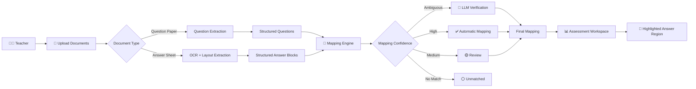
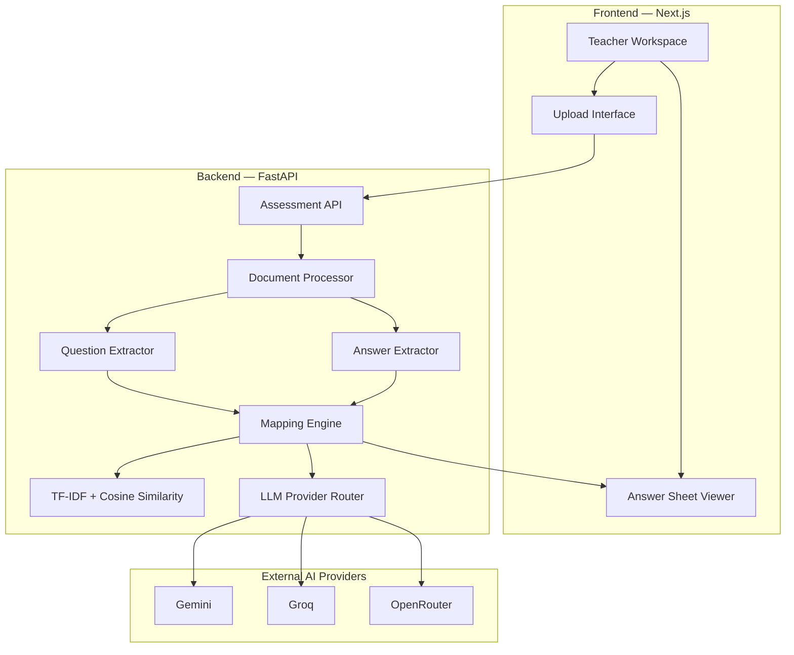
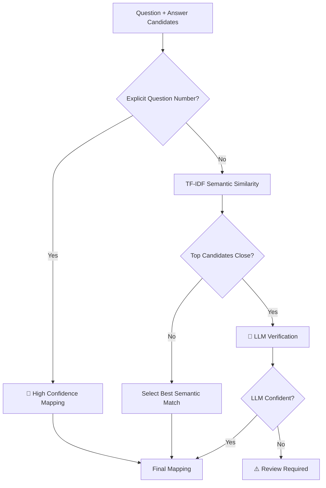
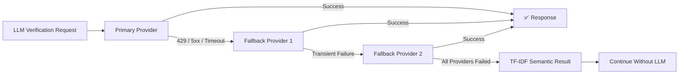

# VedaAI — AI Assessment Extraction & Answer Mapping

> Upload a question paper and a student's handwritten answer sheet. VedaAI extracts, maps, and visually connects every answer to its question.

**Teacher → Upload → Extract → Map → Review**

---

## 🔄 End-to-End Workflow



---

## 🏗️ System Architecture



---

## 🧠 Answer Mapping Strategy

VedaAI does **not** send every question and answer to an LLM.

Instead, the mapping engine uses a layered strategy:



### Why this approach?

- **Fast** — deterministic matching handles obvious cases.
- **Cheap** — LLM calls are only made when necessary.
- **Reliable** — low-confidence matches are not forced.
- **Explainable** — every mapping contains its method and confidence.

---

## 🤖 LLM Provider Fallback



Provider order:

**Gemini → Groq → OpenRouter → Semantic-only fallback**

Invalid API keys and invalid requests are **not retried**.

---

## 📍 Interactive Answer Mapping

When a teacher selects a question, VedaAI identifies the corresponding answer and jumps directly to its location on the student's answer sheet.


---

## 📁 Repository Structure

```text
VedaAI/
│
├── backend/
│   ├── app/
│   │   ├── services/
│   │   │   ├── document_processor.py
│   │   │   ├── question_extractor.py
│   │   │   ├── answer_extractor.py
│   │   │   ├── mapping_engine.py
│   │   │   ├── embedding_service.py
│   │   │   └── llm_provider.py
│   │   │
│   │   ├── models/
│   │   └── main.py
│   │
│   └── requirements.txt
│
└── frontend/
    ├── components/
    ├── app/
    ├── public/
    └── package.json
```
